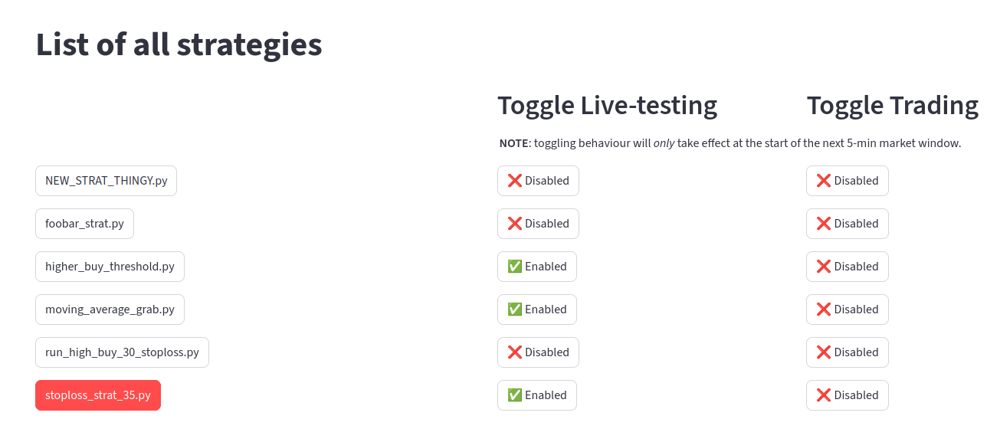
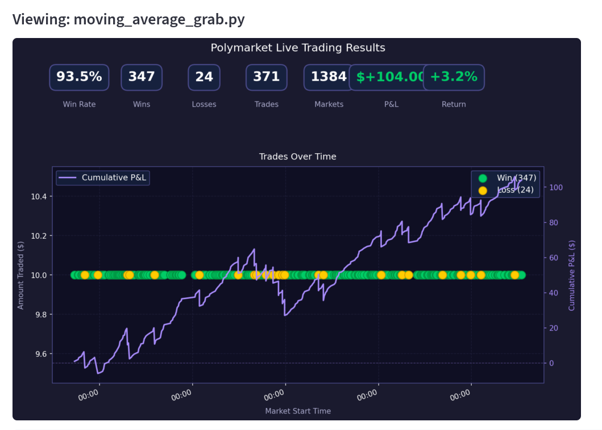
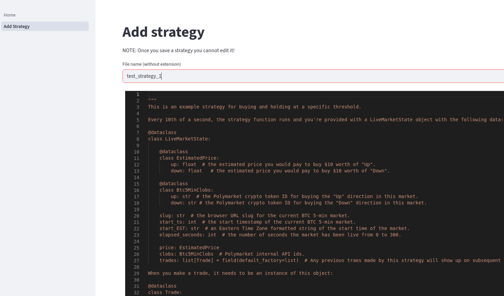

# PTP-SAM
PTP-SAM (short for Polymarket-Testing-Program-SAM) is a program for live-testing various trading strategies on [Polymarket](https://docs.polymarket.com/). It currently only supports live-testing the BTC 5-min market. However, I am actively working on live-trading, backtesting, and will consider adding other markets in the future.

## Installation
Follow these steps if you want to install PTP-SAM on your machine.

#### Pre-requisites
This program requires a Python version in the range of `>=3.12.3,<3.15` and uses the [Poetry](https://python-poetry.org/) package manger. You will also need to install and run [Redis](https://redis.io/), which is used for live and historical BTC price caching.

#### Steps
1. Copy  `.env-template` to a file called `.env` and add your `POLYMARKET_PRIVATE_KEY` and `POLYMARKET_USER_WALLET_ADDRESS`. These are needed for the py-clob-client, which communicates with Polymarket to gather live price data.
    1. **WARNING:** Although this program should not make any trades unless you specifically enable the trading function, I am not responsible if you lose money because there is a bug in my software. Please read [The UNLICENSE](/UNLICENSE) for more information about this software's warranty (or lack thereof).
    3. I recommend making a new Polymarket account and using those credentials for live-testing.
2. Run `poetry install` to install the Python dependencies.
3. Make sure redis is running. If you run `redis-cli info` and it returns a bunch of information about redis's runtime, then it's probably running.
4. That's it! You hould now be able to run  `poetry run python main.py` and visit streamlit's dev-server URL.

## Usage
You can view a list of your strategies on the main page of the webapp and toggle their behaviour. You can also view a strategy's performance, and code, by clicking on it's name and scrolling down.

If you want to add a new strategy, click "Add Strategy" on the left sidebar, edit the code, and press save. Monitor the logs for any errors and check back in 10 minutes to see if it's made any trades!

#### Todos
- [x] Make streamlit-added strategy files work with live_monitor.py.
- [x] Validation on save and before execution of python strategies for security.
- [x] Deploy with nginx basicauth.
- [x] Kraken btc live price, window start price, and historial data (all shared across processes).
- [x] Add options to plotting function to bet a percent of a cash pool over time (instead of betting the logged amount).
- [ ] Simulate backtesting via live-replay. Check out https://archive.pmxt.dev/Polymarket for historical price data from polymarket.
- [x] Finish refactor.
- [ ] Add live-trading capabilities.
- [ ] Unit-tests, especially kraken_fetcher.py, live_monitor.py, and trade_processor.py.
- [ ] Crybook / error handling for each process (similar subfolder structure to enabled and then show red error next to strategy in editor).